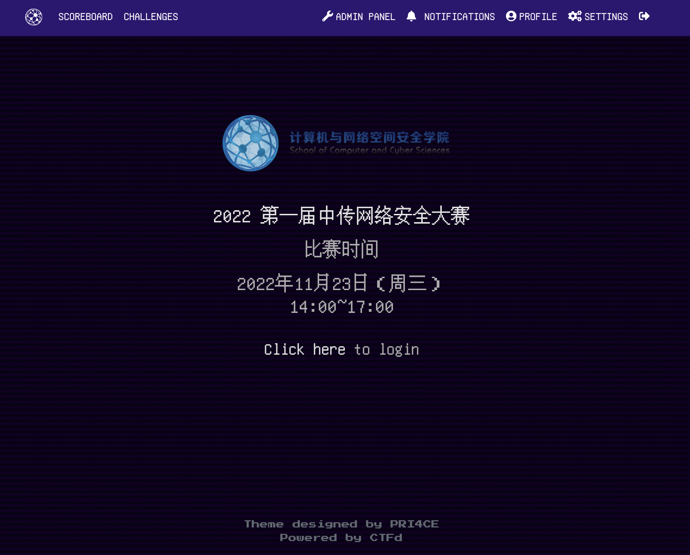

# 学吧，学无止境

## 第一周（2022.11.7-2022.11.13）

- Star了 [Awesome Fuzzing](https://github.com/cpuu/awesome-fuzzing#readme) 仓库，准备好好学学。 [awesome](https://github.com/sindresorhus/awesome) 仓库还有很多很好的项目。
- [Fuzzing101](https://github.com/antonio-morales/Fuzzing101) 做了 exercise 1、2

## 第二周 （2022.11.14-2022.11.20）

- CUCTF 比赛服务器搭建与运维保障
  - 
- [学习 jwt 的绕过方法](../安全/WEB安全/JWT绕过.md)
- 没有什么结果的挖洞

