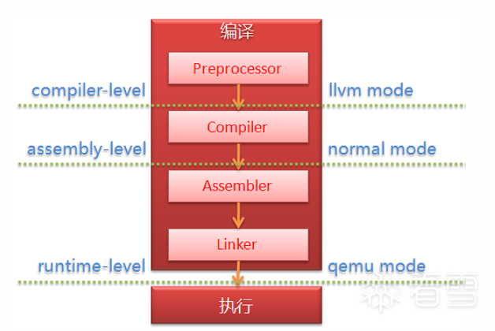

# AFL速通——流程及afl-fuzz.c源码简析

根据 compiler 的选择不同会影响后续 fuzzing 效率。

1、LTO mode (afl-clang-lto/afl-clang-lto++)

LTO（Link Time Optimization）链接时优化是链接期间的程序优化，多个中间文件通过链接器合并在一起，并将它们组合为一个程序，缩减代码体积，因此链接时优化是对整个程序的分析和跨模块的优化。

需要 llvm 11+，这是当前 afl 支持的效率最高的选择（理论上，实际情况会受未知因素影响，比如 fuzzing libxml2 的时候），也意味着编译要花更长时间。

2、LLVM mode (afl-clang-fast/afl-clang-fast++)

依赖 LLVM 的 optimizer，稳定性较高的编译器，用的比较多，可以跨平台（non-x86）编译。

实现了编译级插桩，效果比汇编级插桩更好。

3、GCC_PLUGIN mode (afl-gcc-fast/afl-g++-fast)

效果和 LLVM mode 差不多，不过依赖的是 GCC_plugin，也比较推荐。

4、GCC mode (afl-gcc/afl-g++) (or afl-clang/afl-clang++ for clang)

相较其他编译器，没别的特色，基本用不到。

## 参考资料

- https://www.wangan.com/p/7fy7f811ebc384ac
