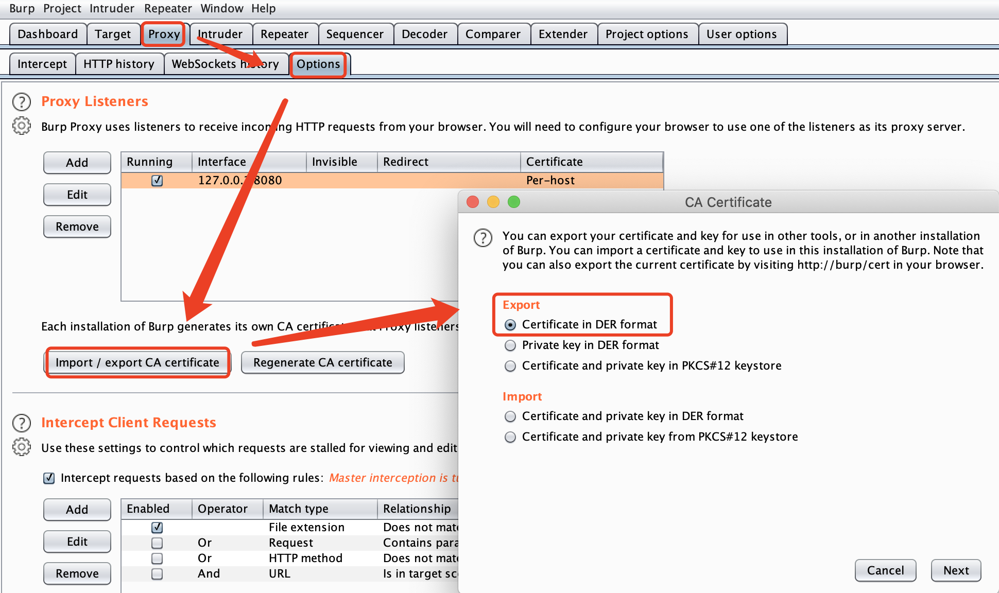
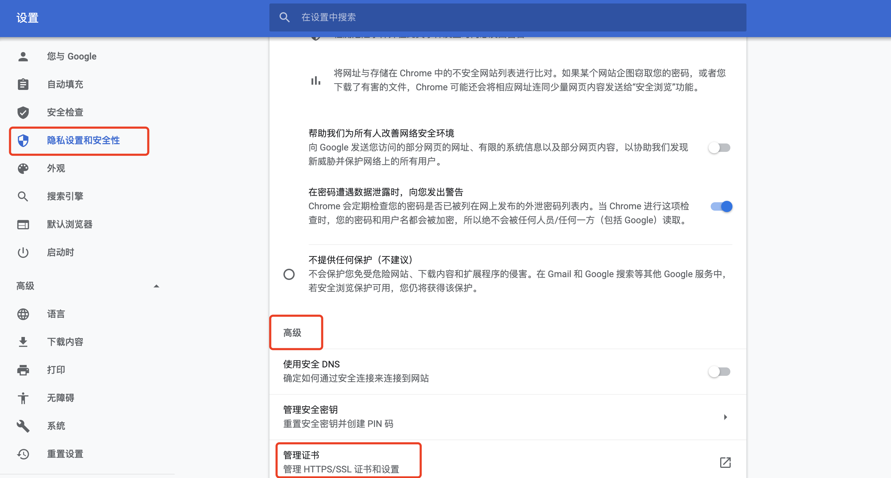
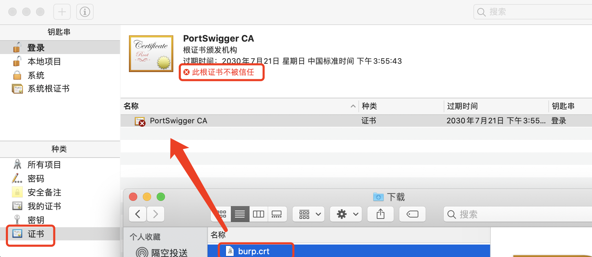
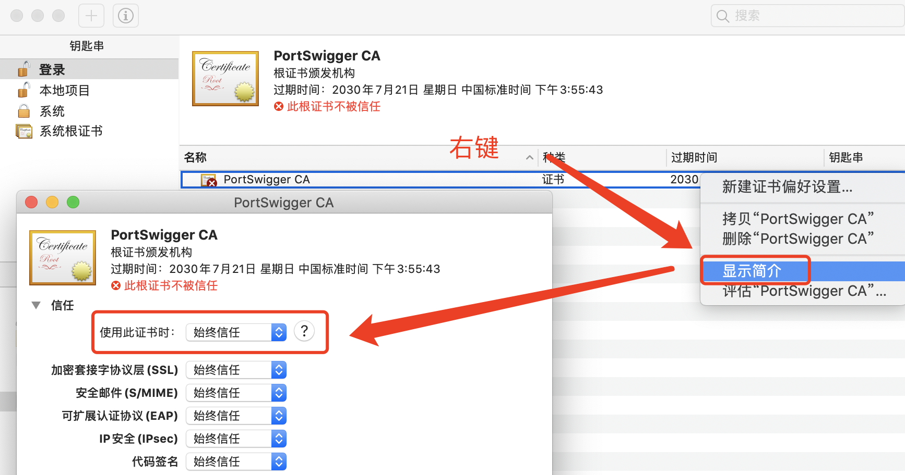

# Mac下Chrome导入burp证书 

## 引入

MacOS上使用BurpSuite拦截HTTPS流量请求会出现站点不信任的情况，需要导入BurpSuite的证书。

## 方法

### 导出BurpSuite证书

### 导入证书

谷歌浏览器切换到证书管理

将导出的证书拖拽到证书Tab，此时根证书是不被信任的。

### 信任证书

右键选中证书 >>  显示简介 >> 使用此证书时，设置为始终信任。 会让你输入系统密码即可。

